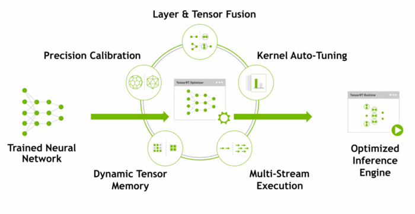

* content
{:toc}

本文对TensorRT对深度学习模型的优化进行介绍，主要是翻译英文文档。

# 1. 什么是TensorRT

TensorRT是NVIDIA为加速NVIDIA平台GPUs的模型推理而开发的一个lib，它基于CUDA和NVIDIA并行编程模型，在GPU上可获得4-5倍的加速效果，是CPU推理速度的40倍。

本文讲两个事，一，TRT是怎么加速深度学习模型的？二，如何使用TensorFlow-TensorRT模型来枷锁推理（略）。

# 2. TensorRT如何实现优化

共有5个方面。

## 2.1. 模型量化

在训练阶段，参数和激活层都是FP32的精度，可以量化到FP16、INT8精度，但必定会损失一定的准确度。对于FP16，截断的部分可以认为是噪声，实际证明，直接转换到FP16，的确没有过多的影响最终的准确度，一般可以接受，但INT8就不行。

INT8的精度下降实在是太多了，[-127 to +127]的参数值范围造成严重的精度损失，最终的准确度完全不能接收。我们的策略是，使用缩放和偏置来减轻精度损失带来的准确度下降问题。

**如何确定缩放因子和偏置量？**

首先，我们假设进行盲目的缩放操作，将`-|max| and |max| in FP32` 映射到 `INT8 -127 and 127`，像上图左边的映射示例。经验发现，这样的映射对准确度的影响仍然过大。但就像FP32截断到FP16一样，也许我们不用直接从FP32映射，而是选择一个较低的阈值。就像上图的右边部分，选择一个比FP32-max更小的值T，从`[-T, +T]`映射即可。我们使用[KL散度](https://en.wikipedia.org/wiki/Kullback%E2%80%93Leibler_divergence)来找到这个值T，使得映射之后的分布与原始分布的差异最小。

**校准数据**

为了评估量化效果，计算KL散度，需要有一些数据为作为依据。这些数据就成为Calibration data.

## 2.2. 层和张量融合

由于激活层在推理阶段，参数固定的，根据研究发现，将激活层中的参数固定后，Conv+BN的过程可以整合为Conv相同的公式，于是可以将参数先计算后，融合到Conv的参数中，然后将BN层去掉，改用一个融合后的Conv层。

参考[Speeding up model with fusing batch normalization and convolution](https://learnml.today/speeding-up-model-with-fusing-batch-normalization-and-convolution-3)

现在，pytorch、onnx-simplify等都自带fusing功能了，即使TRT不支持，在转换为TRT模型之前，先fusing也是没问题的。

## 2.3. Kernel优化

TRT kernel会根据特定的平台实现，为深度学习网络中的算子提供不一样的优化实现，比如卷积操作就有多种实现方式，平台会自动选择一种自己的最优实现。

## 2.4. 动态内存

TRT在进行模型推理时，只有在用到Tensor时才进行内存申请，从而更快更有效的执行。

## 2.5. 多流执行（Multiple Stream Execution）

基于并行结构，TRT支持多输入流，并行推理。

完毕。

后面是TF-TRT的使用介绍，略。

